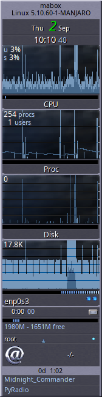
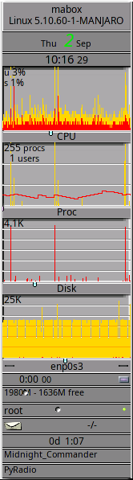
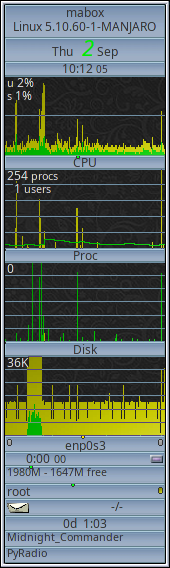
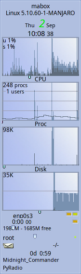
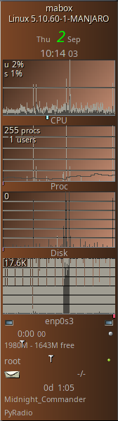

<div class="gal1">
    <a href="../../img/gkrellm.jpg" title="GKrellM"></a>
</div>

**GKrellM** (GNU Krell Monitors) is a somewhat forgotten program with very interesting features. 

GKrellM monitors system operating parameters such as:

- CPU utilization 
- running processes 
- memory usage 
- write and read from disks 
- incoming and outgoing transfer with statistics counting (for a day, week and month) 
- battery status 
- incoming mail monitoring

Each sensor monitor has a configurable alarm and warning.

GKrellM can run in client mode and collect data from a gkrellmd server running on a remote machine.

We can attach our own command to each of the monitors, or rather its label - which allows to significantly expand the functionality of GKrellM. For example, under the CPU we can attach the command to run `top` or `bpytop` in the terminal. 

The functionality of the program can also be extended by installing plugins - their list is really extensive - just search for gkrellm in the package manager. Temperature monitoring,  P2P network monitoring, weather information or music player control are just a few examples.

```
yay gkrellm
```
<div class="gal4">
    <a href="../../img/gkrellm-cpu.png" title="gkrellm - cpu"></a>
    <a href="../../img/gkrellm-general.png" title="gkrellm - general"></a>
    <a href="../../img/gkrellm-mail.png" title="gkrellm - mail"></a>
    <a href="../../img/gkrellm-battery.png" title="gkrellm - battery"></a>
    <a href="../../img/gkrellm-filesystem.png" title="gkrellm - filesystem"></a>
    <a href="../../img/gkrellm-gkrellmlaunch.png" title="gkrellm - gkrellmlaunch "></a>
    <a href="../../img/gkrellm-themes.png" title="gkrellm - themes"></a>
</div>


!!! info "GKrellM in Mabox Linux"
    Mabox comes with GKrellM preinstalled. It is disabled by default, but you can enable it by:
    
    **Settings menu** ++super+s++ -> **Autostart** -> **Choose apps/services (GUI editor)**
    
    There are two options:
    
    - **GKrellM** 

    - **GKrellm in dock** 

    If you decide to run **GKrellm in dock** - use ++super+alt+d++ to show/hide dock. You can also hover your filesystem over right screen edge.

GKrellM comes with a few themes, many more can be installed with **gkrellm-themes** package:
```
yay -S gkrellm-themes
```






