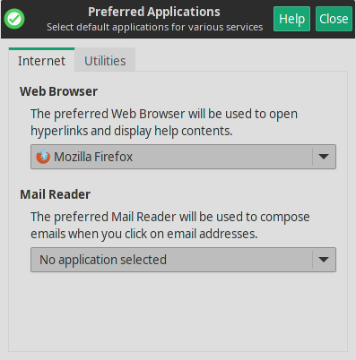
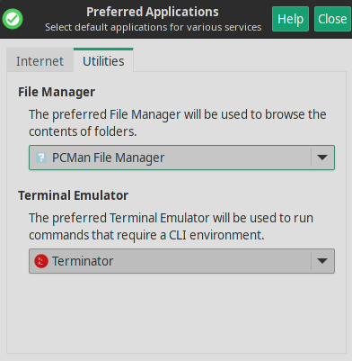

Mabox provides a few pre-installed applications – not too many – by default we won’t find an office suite or GIMP editor here. Installing your favorite programs is a task that will definitely be best done by the user himself according to his preferences (see [Software Management](../getting-started/software-management.md)).

However, several important applications are pre-installed. Below is a brief description and important information for users who want to change the default programs.

- **Web Browser** ++super+w++  - Firefox
- **File Manager** ++super+f++  - *read more about* [PCManFM](../apps/pcmanfm.md)
- **Terminal Emulator** ++super+t++ - *read more about* [Terminator](../apps/terminator.md)
- **Mail Reader** - *not installed by default*

!!! info
    If you like to change the default **web browser**, **file manager** or **terminal emulator** we recommend to set them as the default via **Menu ++super++** -> **Mabox Config** -> **Preferred applications**. This way you can still launch them from the panel icons or the keyboard shortcut.

    
    
