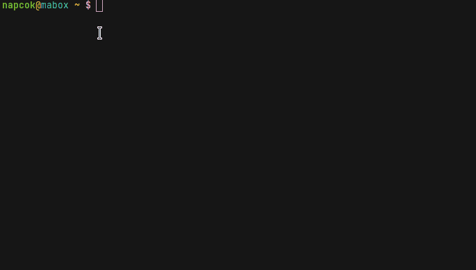

<div class="gal1">
    <a href="../../img/terminator-split.jpg" title="Terminator"></a>
</div>


## Overview

**Terminator** ++super+t++ is default terminal emulator in Mabox.

Terminator is an advanced terminal emulator, which is a great proposition for people who often work in many terminals.

Some of Terminator features:

- split terminals and arrange terminals on the grid
- tabs
- change of terminal arrangement (drag and drop and shortcuts)
- many keyboard shortcuts
- saving multiple layouts and profiles using the GUI preferences editor
- simultaneous writing to any terminal groups (broadcasting)


## Keyboard shortcuts
++shift+ctrl+o++ – split horizontally (this is o like horizontally, not zero)

++shift+ctrl+e++ – split vertically

++alt+"Arrows"++ – move directly between terminals, similarly ++ctrl+shift+tab++ and ++ctrl+shift+n++ or ++ctrl+shift+p++

++ctrl+shift+x++ – zoom active terminal (toggle)

++super+shift+r++ – change the mutual position of the panels (terminals)  counterclockwise

++ctrl+shift+w++ – close terminal

++ctrl+plus++ – increase font size (also ctrl + mouse wheel)

++ctrl+minus++ – decrease font size (also ctrl + mouse wheel)

++ctrl+0++ – restore original font size


## Quake-like terminal
Mabox provides a little wrapper around terminator, which works like drop-down quake-like terminal.

Keybind to start it is ++ctrl+grave++ (tilde).

Subsequent use of ++ctrl+grave++ will hide or show **Quake terminal**.
To quit use ++alt+f4++ or just logout from shell by ++ctrl+d++ or:
```
exit
```

<div class="gal1">
    <a href="../../img/mabox-terminal.jpg" title="Quake-like terminal wrapper"></a>
</div>


By default **Quake terminal** appears on top and its size is 75% width and 50% height, but you can change and save its size and position.

Resize window: ++alt+r++ then resize by mouse.

Move to your preferred place: ++alt+m++ then move by mouse.

Save new position and size by command:
```
mabox-terminal save
```
Next time you start quake-like terminal it will preserve new size and position.
You can reset settings to default by command:
```
mabox-terminal reset
```
See video: <a class="videolink" href="https://www.youtube.com/watch?v=tpwxkc5neZo">yt</a>

## Terminal themes
Terminal colors can be set thanks to themes.sh script.
It comes with 270+ preloaded themes.

```bash
# List available themes
themes.sh -l

# Set new theme
themes.sh nord

# Select theme interactively
th

```


