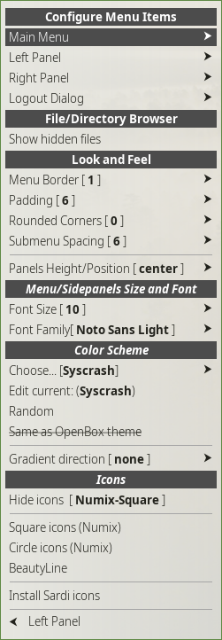

    

## Color schemes, look and feel
Mabox Linux provides many Menu/Sidepanels colorschemes.

To have a quick look at some of them you can use **Random menu colorscheme** located in **Left Sidepanel** ++ctrl+super+left++

{align=left} Much more settings are available from submenu:

**Left Sidepanel** ++ctrl+super+left++ -> **Menu/Sidepanels settings** *(this sumbenu can be also accessed directly: ++super+alt+m++)*

**Configure Menu Items**

In this section you can add your own commands to menu/panels. Also it gives you option to select what should be visiblie in **Left Sidepanel** and how **Applications** should be presented in Main menu.

**File Directory Browser**

Just option to show or hide hidden dir/files in directory browser - used by default in Quick navigation (Left Sidepanel).

**Look and Feel**

Play here with: Border, Padding, Rounded corners, submenu spacing.
Also you can set Sidepanels position here

**Font Size**

Font family and size section

**Color Scheme**

Select Colorscheme here. Or edit it to your needs.

**Icons**

## Adding own commands
!!! info inline end
    Menus, sidepanels and many helpers in Mabox Linux are scripts utilizing [jgmenu](https://jgmenu.github.io/).

You can add your own commands, scripts to menu and sidepanels quite easily.

Go either to **Mabox Control Ceneter** -> **Menu /Sidepanels**

or

**Left Sidepanel** ++ctrl+super+left++ -> **Menu/Sidepanels settings** 

TO BE WRITTEN
## Advanced customization
### Custom submenus

### Pipemenus