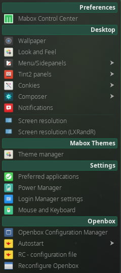

{ align=left }
Mabox **Settings Menu** ++super+s++ is a menu which let you configure most important aspects in Mabox behaviour and look and feel.

**Settings menu elements:**

- **Mabox Control Center** `mcc` - a simple GUI application to configure Mabox. Similarly to the Settings menu, it brings together all the configuration tools for Mabox in one place. Read more about [Mabox Control Center](../mcc/).
- [**Wallpaper**](../wallpapers/) `nitrogen`
- [**Look and Feel**](../lxappearance/) `lxappearance`
- [**Menu/Sidepanels**](../menu-sidepanels/)
- [**Tint2 panels**](../tint2/)
- [**Conkies**](../conky/)
- **Composer**
- **Notifications**
- **Screen resolution** `arandr` and `lxrandr`
- **Theme manager** - save and restore desktop settings. Read more about [Theme Manager](../theme-manager/)
- [**Preferred applications**](../../apps/preferred-apps/) - set default Web Browser, File Manager and Terminal Emulator
- **Power Manager**
- **Login Manager settings**
- **Mouse and Keyboard** `lxinput`
- **Openbox Configuration Manager** `obconf`
- **Autostart** - see [Autostart](../autostart/)
- **RC-configuration file** - edit main Openbox configuration file `~/.config/openbox/rc.xml` in Geany editor
- **Reconfigure Openbox** `openbox --reconfigure` - reload updated Openbox configuration file (`rc.xml`), without need to log out.
