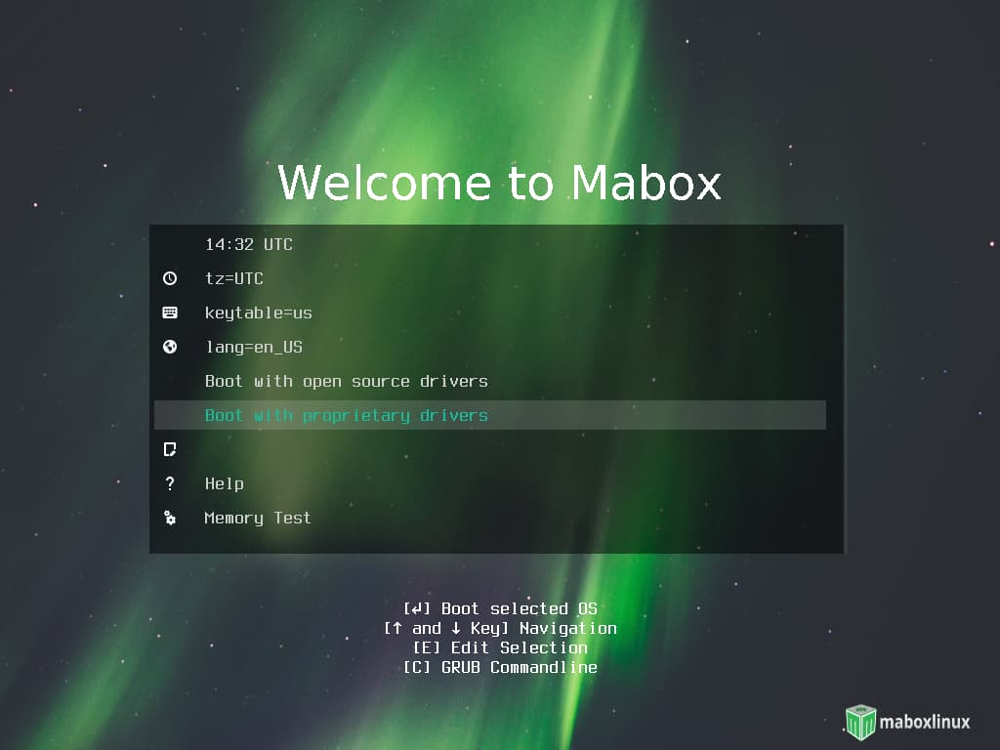

Mabox Linux is available for **64 bit** systems (**amd64**).

ISO images with two kernel versions are available:

- **linux515** – with the latest LTS kernel
- **linux54** – a slightly older LTS kernel that may better support some older hardware

## Download locations
The latest Mabox Linux ISO images can be downloaded from repo.maboxlinux.org or from Sourceforge mirrors

[:fontawesome-solid-download: Download from repo](https://repo.maboxlinux.org/iso/){ .md-button .md-button--primary }
[:fontawesome-solid-download: Download from Sourceforge](https://sourceforge.net/projects/mabox-linux/files/){ .md-button .md-button--primary }

## Check integrity of ISO Image 


After downloading please check **md5sum** for iso image.

Integrity check with md5sum is simple. Open a terminal in the directory where the disk image is saved and type **md5sum** followed by the file name.


## Creating an Installation Medium

To create bootable USB on Windows we recommend using [Rufus](https://rufus.ie).

Linux users can use **dd** command.

```
sudo dd bs=4M if=/PATH/TO/ISO of=/dev/sd[drive letter] status=progress && sync
```
!!! info
    [drive letter] is the letter of your removable device.

    Please note that it is the device (e.g. /dev/sdb), and not the partition number (e.g. /dev/sdb1).

To find which drive letter it might be, run:
```
sudo fdisk -l
```
## Booting from LiveDVD/USB


!!! hint "Use open-source or propertiary drivers"
    While booting the installation media you can choose to use **open source** or **properietary drivers** .



## Installation
Mabox uses **Calamares** installer, so installation is done from a live session.

As Mabox Linux is based on Manjaro, for the installation process you can use very good and detailed Manjaro User Guide.

[:fontawesome-solid-book: Download Manjaro User Guide (PDF)](https://osdn.net/projects/manjaro/storage/){ .md-button .md-button--primary target=blank}

<div class="gal">
    <a href="../../img/calamares2.jpg" title="Calamares installer - Welcome"></a>
    <a href="../../img/calamares3.jpg" title="Calamares installer - Location"></a>
    <a href="../../img/calamares4.jpg" title="Calamares installer - Partitions"></a>
    <a href="../../img/calamares5.jpg" title="Calamares installer - Users"></a>
    <a href="../../img/calamares6.jpg" title="Calamares installer - Summary"></a>
    <a href="../../img/calamares7.jpg" title="Calamares installer - Install"></a>
</div>
*[LTS]: Long Term Support
