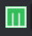
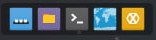
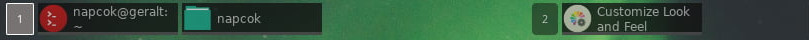
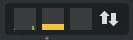
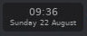
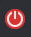
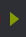
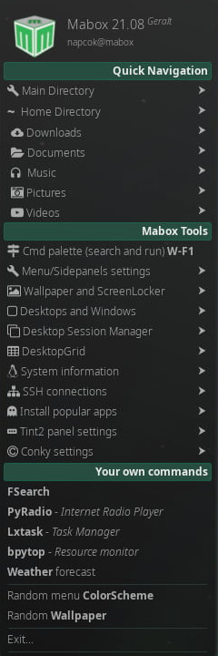

# Introduction to Mabox Linux Desktop

    

## Main Menu

You can access main menu by:

  - click Mabox icon on the panel
  - right click on desktop
  - pressing ++super+space++  or just ++super++ key

Menu allows you to search, just start to type what you looking for.

---

---
## Conky
There are two Conky placed on default Mabox Desktop. **System monitor and info** in the top right corner and bottom-left Conky presenting **most important keybindings**.

You can enable/disable them by ++super+alt+c++.

Read more about [Conky configuration in Mabox](../../configuration/conky/)

---
## Tint2 panel

**Tint2** is lightweight and highly configurable panel used in Mabox. By default it is located on top of the screen.

    

Let's examine every panel element from left to right.
Read more about [Tint2 panel configuration in Mabox](../../configuration/tint2/)
---
### Left Sidepanel launcher
{ align=left }

**Arrow-left button**

is used to launch **Left Sidepanel** ++ctrl+super+left++

---
### Mabox Logo (*menu start*)
{ align=left }

**Mabox logo button**

will launch **Main menu** ++super++

Right click on it will launch **Settings menu** ++super+s++

---
### Launcher

Next is **Launcher** with five icons by default:

- **Show desktop** ++ctrl+d++
- **File Manager** ++super+f++
- **Terminal Emulator** ++super+t++
- **Web Browser** ++super+w++
- Irc client Hexchat

!!! hint "How to add/remove launchers to/from the panel?"
    Go to **Settings Menu** ++super+s++ -> **Tint2 panels** -> **Add/Remove Launchers**

    <iframe width="560" height="315" src="https://www.youtube.com/embed/CqxQfLXRoWM" title="YouTube video player" frameborder="0" allow="accelerometer; autoplay; clipboard-write; encrypted-media; gyroscope; picture-in-picture" allowfullscreen></iframe>

---
### Desktops tasklists

**Desktop indicators** and **tasklist**.

Task actions:

- **Left click** - toggle or iconify
- **Mouse wheel** - toggle or iconify
- **Middle click** - close
- **Drag** to move window to other desktop

---
### System tray

**System tray** with simple resource monitor.
Five monitors availabe, three enabled by default:

- CPU
- Memory
- Swap *disabled*
- Network usage
- Disc IO *disabled*

Click on monitor will run simple task manager `lxtask`

To configure/disable **Systray HW monitor** go to: **Settings menu** ++super+s++ -> **Tint2 panels** -> **Systray HW monitor**.

---
### Clock

**Clock and date**.
Click to show calendar.

---
### Logout
{align=left}

**Logout Dialog** ++super+x++

---
### Right Sidepanel launcher
{ align=left }

**Arrow-right button**

is used to launch **Right Sidepanel** ++ctrl+super+right++

---
## Side Panels

{ align=left } Mabox Linux provides also two sidepanels for quick access.

**Left Sidepanel** ++ctrl+super+left++ offer quick access to any directory and growing list of Mabox Tools.

You can navigate to place you want, and open file manager or terminal in that location.

Left sidepanel will also show your GTK Bookmarks (bookmarks from filemanager – PCManFM)

Some of Mabox Tools available from Left Sidepanel:

  - **Menu/Sidepanel settings** ++super+alt+m++ – let you change menu/panels look and feel
  - **Wallpaper and ScreenLocker** ++super+alt+w++ - configure wallpaper and ScreenLocker
  - **DesktopGrid** - arrange your windows on the grid with or without gap
  - **DeskMngr** – save and restore desktop sessions (save all windows from current desktop with its size and position, and restore it later on any desktop)
  - **SSH Connections** – list of configured SSH connections, from `~/.ssh/config`
  - **Tint2 configuration menu**
  - **Conky configuration menu**

**Right side panel** ++ctrl+super+right++ is for quick access to various settings and help links.

---
##Wallpapers

**Nitrogen** is used as a basic wallpaper setter.
But there is more options... ++super+alt+w++
