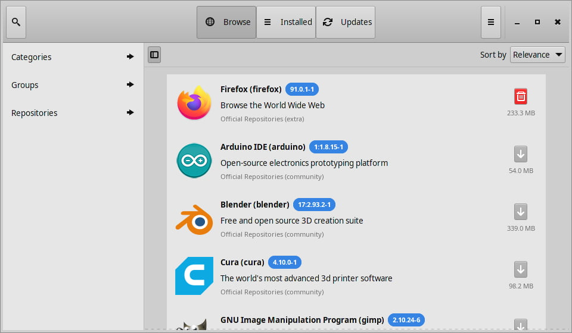

# Software Management

**Mabox Linux** is **Manjaro** *based* distribution, and uses Manjaro official repositories (*stable branch*) and some packages from own Mabox repository.

Mabox Linux, like Manjaro is *rolling-release*, and that means that you have very fast access to the latest software versions.

Package manager is Pamac (pacman is also available aswell as popular yay helper).

By default pamac-applet is running in system tray, so you will be informed about any available updates.

------

## Pamac



Pamac is a powerful tool for managing software through a graphical interface.
Pamac allows you to search packages (according to the groups, the state, the source repository), their installation and removal.

Pamac applet is a program that resides in the system tray, announces the availability of updated packages and allows a convenient way to perform the update.

With Pamac we can configure many aspects of the package manager, for example:

- set the frequency of checking for updates
- choose the fastest mirror and its location
- set the number of versions of packages that will be stored in the disk cache (this allows to downgrade package in rare cases, when the update may cause problems)
- enable **AUR** support
*[AUR]: Arch User Repository

<div class="gal">
    <a href="../../img/pamac_pref1.png" title="Pamac preferences - General"></a>
    <a href="../../img/pamac_pref2.png" title="Pamac preferences - Advanced"></a>
    <a href="../../img/pamac_pref3.png" title="Pamac preferences - Third party"></a>
    </div>
---

## Command line - yay

**Yay** is a very convenient pacman replacement with AUR (Arch User Repository) support.

It works fast and supports most of the same syntax that you already use in Pacman.


###System Upgrade

To perform a system upgrade with yay, simply enter:

```
yay
```

This command will check for updates from distribution repositories as well as packages installed from AUR.
If you type `yay -Syu` out of habit it will work exactly the same. Similar to `yay -Syyu` (here forcing to download databases with packages lists again).


### Installing packages

As an argument we pass the name of the package we want to install. Here, for example, the gdu – pretty fast disk usage analyzer written in Go.
```bash
# search for gdu package
yay gdu
# Yay will search for available packages – both in the repositories and in AUR
# – it will list them and let us choose a package to install.

# install gdu immadietely
yay -S gdu

# install multiple packages
yay -S gimp blender inkscape
```
### Removing packages
To remove a package as with yay, use the -R option. For example:
```
yay -R gdu
```

### Yay statistics
You can also use yay to show some interesting statistics about installed packages.
```
yay -Ps
```
For more info about yay usage:
```
man yay
```

---
