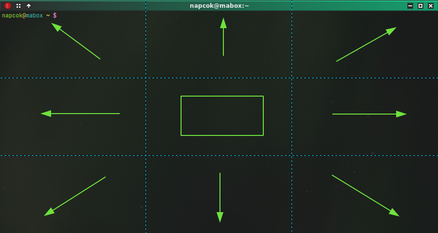

    

Openbox is _floating_ window manager, but in Mabox there are preconfigured some handy actions to manually tile windows if you want.

You can move windows around quickly by some keyboard shortcuts.

_Give it a try while reading_

## Resize and move windows by keyboard
!!! danger inline end "See it in action..."
    See video:<a class="videolink" href="../../img/tiling_super_arrows.mp4">here</a>

_half screen_

Try: ++super+left++ , ++right++ , ++up++ , ++down++

<video controls width="100%" src="../../img/tiling_super_arrows.mp4" type="video/mp4">
</video>

---
!!! danger inline end "See it in action..."
    See video:<a class="videolink" href="../../img/tiling_numpad.mp4">here</a>
_quarter of screen_

With ++super+"keypad keys"++ you can also resize and move window to corner or edge of desktop

||||
|-|-|-|
|++num7++ topleft | ++num8++ top | ++num9++ topright|
|++num4++ left | ++num5++ center | ++num6++ right|
|++num1++ bottomleft | ++num2++ bottom | ++num3++ bottomright|

<video controls width="100%" src="../../img/tiling_numpad.mp4" type="video/mp4">
</video>

### Other useful window related shortcuts

++super+enter++ or ++f11++ - fullscreen, hit again to go back

++super+b++ - toggle window decorations

++alt+f6++ , ++super+home++ - toggle maximize

## Clik to snap
Click on the appropriate area of the window to snap it (on the grid) to given direction.

Use ++ctrl+shift++ + click

See areas...

This works with active and inactive windows, therefore it is very quick way to place them as you need.

<video controls width="100%" src="../../img/tiling.webm" type="video/mp4">
</video>

Note there are a gap between windows. A gap is configurable and is a part of [DesktopGrid](../../extras/desktopgrid) Mabox feature.

Use ++ctrl+shift+"numpad keys 1 to 9"++ to achieve the same effect without using mouse.