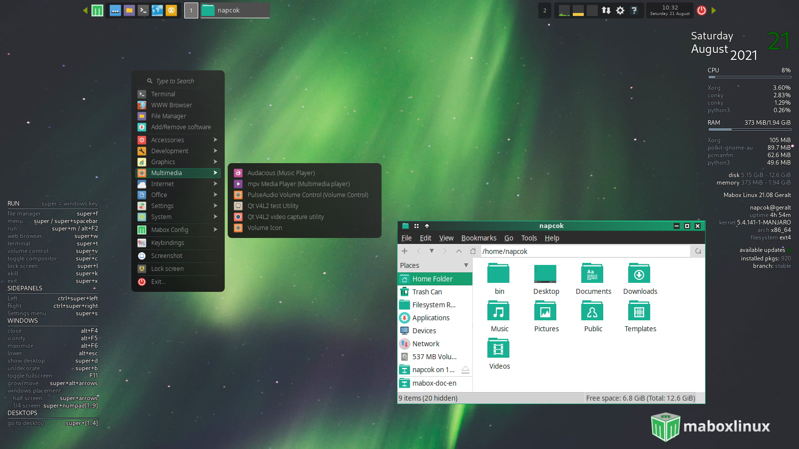
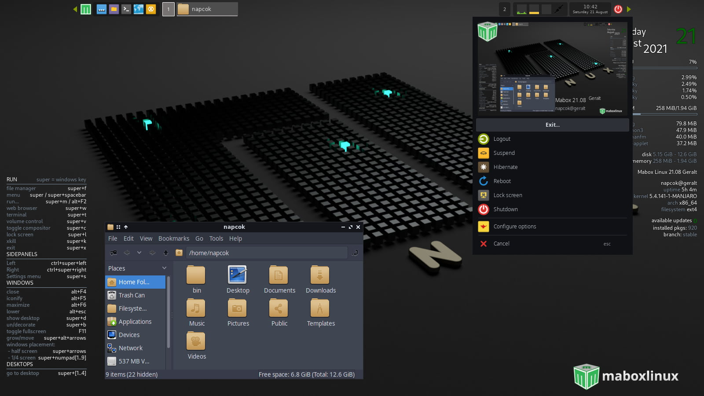
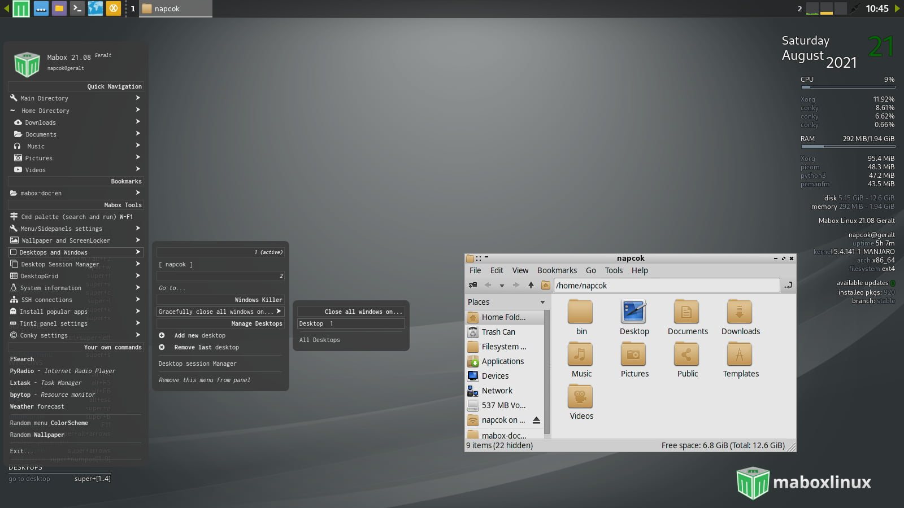
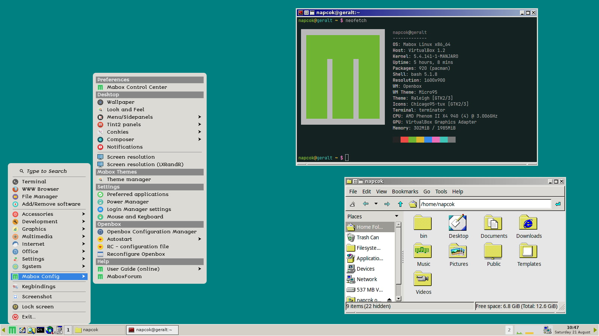
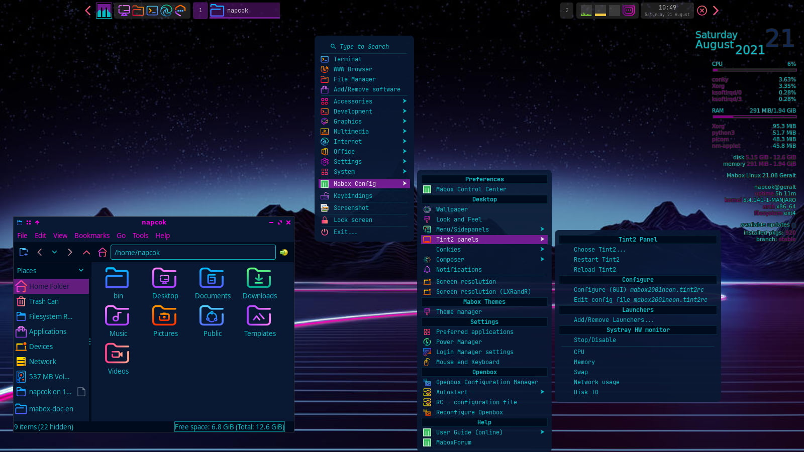
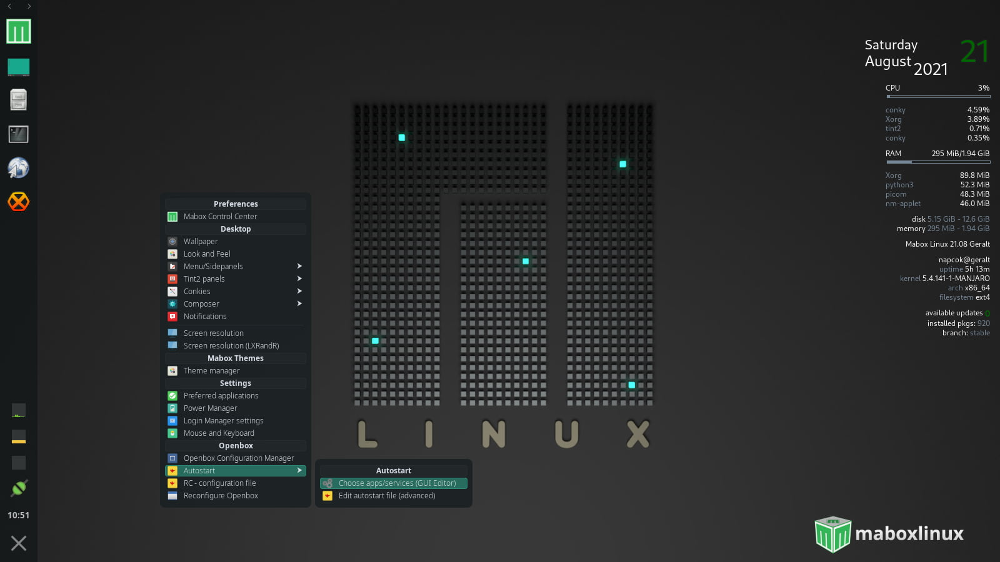
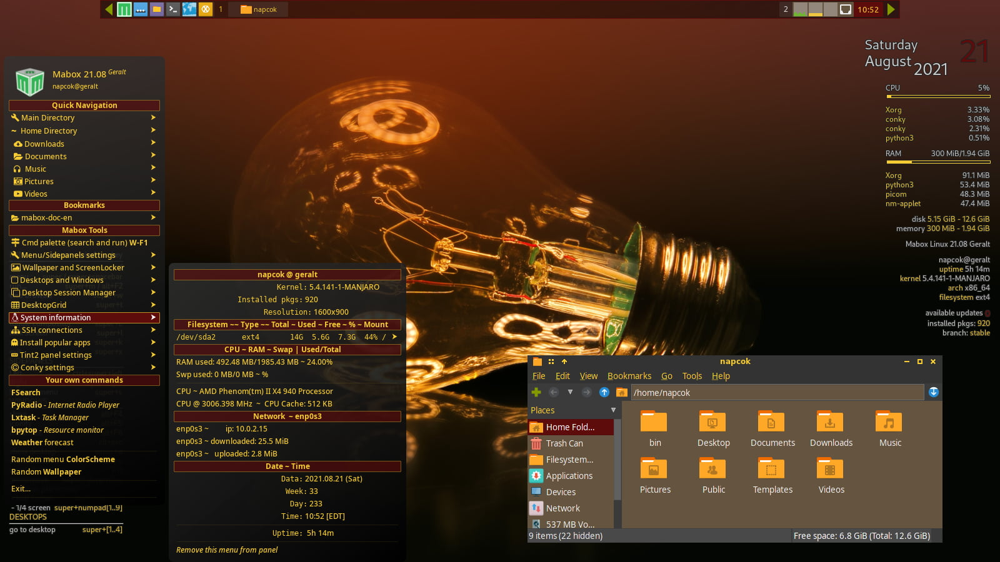

---
hide:
  - navigation
---
# Welcome to the Mabox Linux Manual!
Welcome to the Mabox Manual! This is official reference book for using Mabox. This manual covers many topics, such as installation, applications Mabox provides, and much more!

## What is Mabox?

The project's goals are:

- provide **lightweight, fast** and **ready to use** Linux Desktop, which works nicely even on weaker computers.

- being based on **solid and stable** foundations, enable **quick access** to the **latest software versions**

Mabox is *rolling-release* distribution based on **Manjaro**.

??? info "Advantages and disadvantages of the *rolling-release* development model "
    **Advantages:**

    - Install once & update forever. No need to reinstall the operating system every 6-12 months

    - Quick access to the latest version of software packages, there is no need to resort to snaps or flatpaks to run current software

    **Disadvantages:**

    - Partial updates are unsupported - you must update your system before installing software

    - You need more bandwidth (for updates) than in distributions with *traditional* release model

## What Desktop Environment Mabox use?
There is no fully blown integrated DE in Mabox.
Mabox is build on top of OpenBox WM with addition of carefully selected, lightweight and highly configurable components and some handy home-made tools that help present a streamlined desktop.

- tint2[^1] is used as a panel.

- menus and sidepanels based on jgmenu[^2].

- several home-brewed tools and utilities.

- some components comes from LXDE and Xfce

- few BunsenLabs[^3] tools adapted for Mabox (theme-manager, tint2 and conky manager scripts)

    
    
    
    
    
    
    

## Is Mabox stable for day to day use?

Short answer: **yes**

How is this achieved?

- Mabox is based on **Manjaro stable** branch.
??? info "How Manjaro branches works?"
    From [Manjaro wiki](https://wiki.manjaro.org/index.php/Switching_Branches#Overview):

    >Manjaro packages start their lives in the *unstable* branch. Once they are a deemed stable, they are moved to the *testing branch*, where more tests will be realized to ensure the package is ready to be submitted to the *stable* branch.

    >Packages that come to stable have gone through roughly a couple of weeks testing by the users of the Unstable/Testing repos, before they get the packages. These packages are usually free of any problems.

- Mabox uses *rock-solid* **LTS kernel** by default.

- **Openbox** reached all development goals in 2010 and is a completed project, and very stable WM. There is very occasional maintenance done to keep it working, only if needed.

## Contact Us
Do you have questions? Want to get involved? Take a look at our [official website](https://maboxlinux.org), [blog](https://blog.maboxlinux.org), [Mabox discourse](https://forum.maboxlinux.org).

## Thank you!
Thank you for choosing to use Mabox Linux!

*[DE]: Desktop Environment
*[WM]: Window Manager
*[LTS]: Long Term Support

[^1]: [tint2](https://gitlab.com/o9000/tint2) - a lightweight panel/taskbar for Linux and BSD
[^2]: [jgmenu](https://jgmenu.github.io/) - a simple, independent, contemporary-looking X11 menu, designed for scripting, ricing and tweaking.
[^3]: [BunsenLabs](https://bunsenlabs.org) - Debian based distribution featuring pre-configured Openbox desktop
