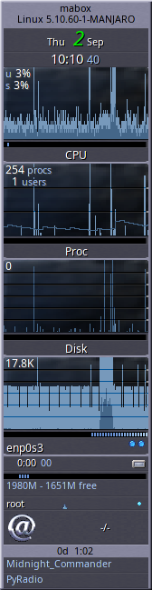
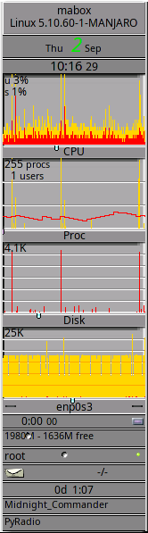
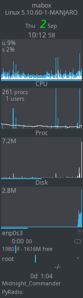
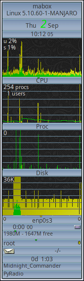
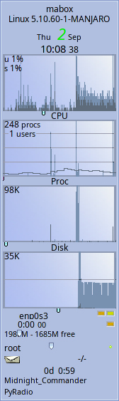
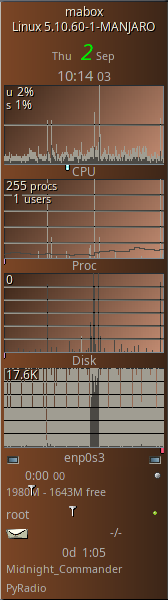

<div class="gal1">
    <a href="../../img/gkrellm.jpg" title="GKrellM"></a>
</div>

**GKrellM** (GNU Krell Monitors) ies de algun modo un programa de monitoreo de sistema olvidado pero con cualidades interesantes. 

GKrellM monitors system operating parameters such as:

- Uso de la CPU  
- Procesos en ejecución 
- Uso de las memorias 
- Discos escritos y de lectura 
- Entrada y salida con registros estadísticos (del día, la semana o el mes) 
- Estado de la batería 
- Monitorea entradas de correos

Cada sensor de monitoreo posee una alarma y una notificacion de precaución.

GKrellM puede ejecutarse en modo cliente y recoger informacion desde un servidor con el mismo  gkrellmd server por acceso remoto.

Podemos agregar nuestras comandos a cada uno de los monitores, bien a sus etiquetas - lo que permite expandir la funcionalidad de GKrellM. Por ejemplo, debajo de la CPU podemos agregar un comando para ejecutar  `top` o bien  `bpytop` desde la terminal. 

La funcionalidad del programa se puede también extender con la instalación de extensiones o  plugins - su lista es muy extensa - sólo busque en el paquete gestor de gkrellm . Monitorea temperatura, redes  P2P , reporte meteorológico o reproductor de música son algunos ejemplos.

```
yay gkrellm
```
<div class="gal4">
    <a href="../../img/gkrellm-cpu.png" title="gkrellm - cpu"></a>
    <a href="../../img/gkrellm-general.png" title="gkrellm - general"></a>
    <a href="../../img/gkrellm-mail.png" title="gkrellm - mail"></a>
    <a href="../../img/gkrellm-battery.png" title="gkrellm - battery"></a>
    <a href="../../img/gkrellm-filesystem.png" title="gkrellm - filesystem"></a>
    <a href="../../img/gkrellm-gkrellmlaunch.png" title="gkrellm - gkrellmlaunch "></a>
    <a href="../../img/gkrellm-themes.png" title="gkrellm - themes"></a>
</div>


!!! info "GKrellM in Mabox Linux"
    Mabox trae preinstalado GKrellM. Esta desactivado por defecto,  pero puede activarlo por medio de :
    
    **Ajustes** o bien  ++super+s++ -> **Autoinicio** -> **Elegir las apps/servicios en el editor GUI **
    
    existen dos opciones:
    
    - **GKrellM** 

    - **GKrellm en la barra** 

    Si decide ejecutar **GKrellm en la barra** - use ++super+alt+d++ para mostrar/esconder la barra. También puede mover el raton hacia el borde derecho de la pantalla y aparecerá.

GKrellM viene con unos pocos temas, muchos más se pueden instalar con el paquete extra  **gkrellm-themes** :
```
yay -S gkrellm-themes
```






