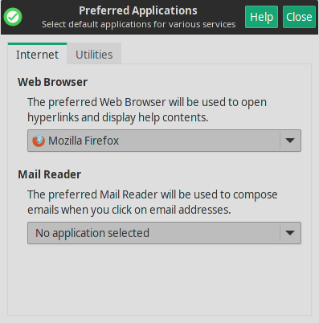
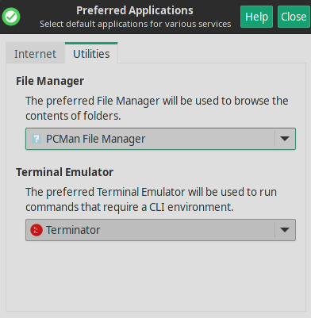

Mabox le ofrece pocas aplicaciones pre-instaladas – no demasiadas – por defecto no encontrará suite de ofimática o bien editor gráfico de GIMP aquí. Preferimos que instale sus programas favoritos como una tarea la que sin duda será mejor  realizada por el usuario de acuerdo a  sus preferencias (ver  [Gestor de software](../getting-started/software-management.md)).

Sin embargo, Mabox trae pre-instaladas aplicaciones importantes. Abajo hay una descripción breve con informacion para los usuarios con el fin de que cambien estos programas por defecto :) .

- **Navegador** ++super+w++  - Firefox
- **Gestor de archivos/ficheros** ++super+f++  - *lea mas acerca de* [PCManFM](../apps/pcmanfm.md)
- **Terminal ** ++super+t++ - *lea más acerca de* [Terminator](../apps/terminator.md)
- **Lector de correo** - *no viene instalado por defecto*

!!! info
    Si usted no quiere cambiar estos programas por defecto **navegador**, **gestor de archivos** o **terminal** recomendamos que los establezca como por defecto de la siguiente forma **Menu  o bien tecla ++super++** -> **Ajustes** -> **Aplicaciones Preferidas**. De este modo usted siempre las ejecutará de todas las formas Mabox posibles, como icono del menu o del panel o bien de atajos de teclas.

    
    
