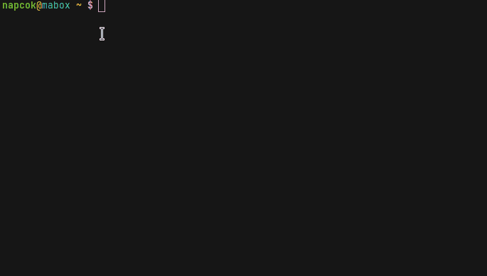

<div class="gal1">
    <a href="../../img/terminator-split.jpg" title="Terminator"></a>
</div>


## Detalles generales

**Terminator** ++super+t++ es el emulador de Terminal por defecto en Mabox.

Terminator es un emulador de terminal avanzado, el cual  parece ser una propuesta grandiosa para los usuarios que usan muchos terminales al mismo tiempo.

Algunas de las cualidades de Terminator son:

- dividir y reacomodar terminales en la rejila visual
- pestañas
- cambiar el aspecto de la terminal (arrastar y dejar caer  y ademas atajos de teclado propios)
- muchos atajos de teclado
- guardar perfiles y aspecto visual de acuerdo a las preferencia del usuario
- escribir simultaneamente en cualquier terminal a cualquier otro grupo de terminal (trasmisión)


## Atajos de teclado
++shift+ctrl+o++ – divide horizontalmente una terminal  (this is o like horizontally, not zero)

++shift+ctrl+e++ – divide verticalmente una terminal 

++alt+"Arrows"++ – se mueve de una terinal a otra con las teclas de flechas, al igual que  con  ++ctrl+shift+tab++ y con  ++ctrl+shift+n++ o bien  ++ctrl+shift+p++

++ctrl+shift+x++ – activa el aumento o zoom del terminal  (toggle)

++super+shift+r++ – intercambia la ubicacion de dos terminales hacias el sentido del reloj

++ctrl+shift+w++ – cierra la  terminal

++ctrl+plus++ – aumenta el tamaño de la fuente (también con  ctrl + la rueda del ratón)

++ctrl+minus++ – disminuye el tamaño de la fuente (también con  ctrl + rueda del ratón)

++ctrl+0++ – restaura el tamaño original de la fuente


## Quake-la terminal desplegable 
Mabox ofrece una extensión de la terminal  terminator, el cual opera como una terminal desplegable en la pantalla.

El atajo de teclado para iniciarlo es ++ctrl+grave++ (tilde).

La insisitencia de la primera combinación de teclas hace un uso irregular para esconder o bien mostrar de nuevo la terminal desplegable opere este atajo nuevo ++ctrl+grave++ esconderá o mostrará el  **Quake terminal**.
Para salir de esta terminal desplegable use  ++alt+f4++  o bien salir de esta con  ++ctrl+d++ o anote  esto y presiones tecla enter desde Quake terminal:
```
exit
```

<div class="gal1">
    <a href="../../img/mabox-terminal.jpg" title="Quake-like terminal wrapper"></a>
</div>


Por defecto esta **Quake terminal desplegable** aparece en la parte superior y su tamaño es de 75% de ancho y  50% de alto, usted puede cambiar estos parametros y guardar sus preferencias de tamaño y posición.

Cambiar el tamaño de la ventana con: ++alt+r++ y entonces ajustar el tamaño con el ratón.

Desplazarlo a su lugar preferido con : ++alt+m++ y entonces arrastrelo con el ratón.

Guarde la nueva posición y el tamaño preferido con la comando en la terminal :
```
mabox-terminal save
```
La próxima vez que  inicie Quake terminal se mantendrá con el tamaño y posición ya guardada.
Si desea recuperar los parametros automaticos predefinidos lo puede hacer con la esta comando en la terminal:
```
mabox-terminal reset
```
Vea este video: <a class="videolink" href="https://www.youtube.com/watch?v=tpwxkc5neZo">yt</a>

## Temas de la Terminal 
Los colores de la terminal se pueden ajustar gracias al programa script themes.sh script.
Viene con 270 temas precargados.

```bash
# Lista temas disponibles
themes.sh -l

# Establece el nuevo tema
themes.sh nord

# Seleccion interactiva de un tema
th

```


