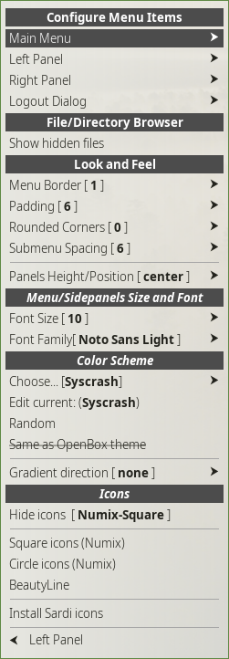

    

## Esquema de Color, Apariencia
Mabox Linux aporta variados esquemas de colores para sus  Menu/Paneles Laterales y otros esquema qu el mismo usuario puede crear y agregar.

Para echar un vistazo rápido a algunos que usted pueda usar/crear revise en  **Random colorscheme** ubicado en el **Panel lateral izquierdo** o bien con las teclas  ++ctrl+super+left++ en la parte inferior

{align=left} Existen muchos otros ajustes disponibles  en su submenu:

**Panel lateral izquierdo** o bien con las teclas ++ctrl+super+left++ -> **Ajustes de Menu/Paneles laterales** *(este submenu puede ser llamado directamente con el atajo de tecclas: ++super+alt+m++)*

**Configurar los ítemes del menu**

En esta sección usted puede agregar sus propios comandos en el menu/paneles. Además le ofrece la opción de seleccionar que ítemes deberían estar visibles en  **Panel lateral izquierdo** y como estas  **Aplicaciones** agregadas deberían ser presentadas en el Menu principal.

**Navegar por los directorios de archivos**

Sólo entrega la opción de mostrar/esconder los directorios de archivos de sus sistema Mabox - usado para una navegacion veloz por defecto en el  (Panel lateral izquierdo).

**Apariencia**

Juege aquí con : el borde, la separación, esquinas redondas, espaciado entre submenu.
Además puede ajustar la posición exacta de los paneles laterales en relación a el resto del espacio en la pantalla aquí

**Tamaño de la fuente**

Sección del tipo y tamaño de la fuente

**Esquema de colores**

Seleccionar el esquema de color aquí. O editarlo de acuerdo a sus necesidades.

**Iconos**

## Agregando sus propios comandos personalizados
!!! info inline end
    Menus, paneles laterales y muchos asistentes en Mabox Linux son scripts utilitarios usando [jgmenu](https://jgmenu.github.io/).

Usted puede agregar sus comandos propios, como scripts que se anexan al menu o bien a los paneles laterales con facilidad.

Vaya a uno de estos lugares para hacerlos **Mabox Centro de Control** -> **Menu /Paneles laterales**

o bien en 

**Panel lateral izquierdo**  o bien con las teclas ++ctrl+super+left++ -> **Ajustes de Menu/Paneles latrales** 

POR SER REDACTADO PRONTO...
## Personalización avanzada
### Personalizar submenus

### Pipemenus
