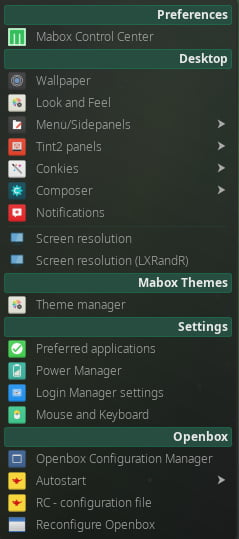

{ align=left }
 **Menu de  ajustes**de Mabox ++super+s++ es el cual le permite que se configuren la mayoría de los aspectos importantes del comportamiento en Mabox ademas de la apariencia general.

**Elementos del menu de ajustes:**

- **Centro de Control Mabox** `mcc` - una aplicacion gráfica simple para configurar todo el sistema de Mabox desde una sola ventana. Parecido al Ajuste del menu, pero esta nueva contiene todos las herramientas de ajustes en un solo lugar. Lea más de esto en  [Mabox Centro de Control ](../mcc/).
- [**Fondos de escritorios**](../wallpapers/) `nitrogen`
- [**Apariencia**](../lxappearance/) `lxappearance`
- [**Menu/Paneles laterales**](../menu-sidepanels/)
- [**Panel de Tint2 **](../tint2/)
- [**Conkies**](../conky/)
- **Compositor Picom**
- **Notificaciones**
- **Resolución de pantalla** `arandr` and `lxrandr`
- **Gestor de Temas** - guarde y restaure los ajustes de su escritorio. Lea más acerca de esto en  [Gestor de temas](../theme-manager/)
- [**Aplicaciones preferidas**](../../apps/preferred-apps/) - cambie el  navegador por defecto, el gestor de archivos y la Terminal
- **Gestor de energía**
- **Ajustes del gestor de sesiones**
- **Ratón y teclado** `lxinput`
- **Gestor de ajustes de Openbox** `obconf`
- **Reinicio** - vea [Autostart](../autostart/)
- **Archivo de  configuración nativo de Openbox** - edite el archivo principal de la configuración global de  Openbox en  `~/.config/openbox/rc.xml` in Geany editor
- **Reconfigurar Openbox** `openbox --reconfigure` - recarga desde el archivo actualizado la configuracion inicial de Openbox  para Mabox (`rc.xml`), sin necesidad de salir y reiniciar.
