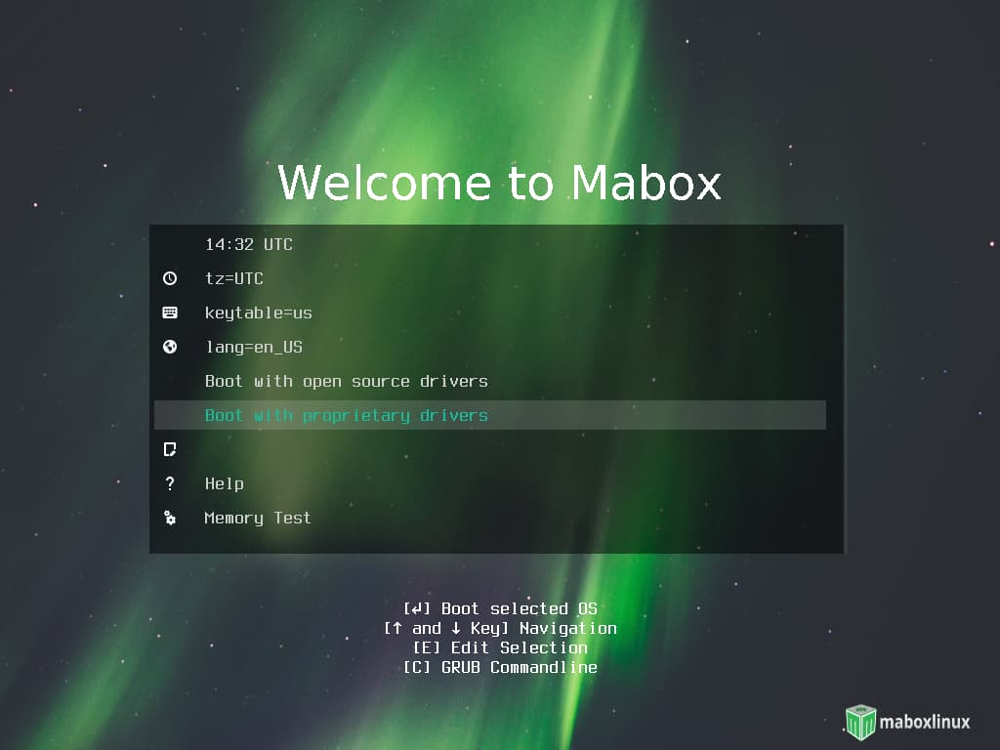

Mabox Linux esta disponible para sistemas de  **64 bit** (**amd64**).

Las imágenes ISO estan disponibles para dos versiones de núcleos o kernel  linux:

- **linux515** – con el más actualizado  LTS kernel o núcleo de linux de soporte con mas larga duración
- **linux54** –  es núcleo linux o  LTS kernel más antiguo pero que puede soportar sistemas de hardware mas viejos

## Ubicaciones de Descargas 
Ambas imágenes ISO de Mabox pueden ser descargadas desde  repo.maboxlinux.org o bien desde  Sourceforge mirrors

[:fontawesome-solid-download: Download from repo](https://repo.maboxlinux.org/iso/){ .md-button .md-button--primary }
[:fontawesome-solid-download: Download from Sourceforge](https://sourceforge.net/projects/mabox-linux/files/){ .md-button .md-button--primary }

## Revisar la integridad correcta de la imagen ISO 


Una vez descargada Mabox por favor revise con  **md5sum** la integridad de su imagen iso.

La revisión de integridad con md5sum es simple. Abra una terminal justo en el directorio en donde esta guardada su imagen y escriba  **md5sum** seguido del nombre completo del archivo de la imagen.


## Creando un medio de instalación para su imagen ISO 

Para crear una unidad USB  ejecutabe de Mabox en el sistema operativo Windows, le recomendamos que use [Rufus](https://rufus.ie).

Para los usuarios de Linux, usar desde la terminal el comando **dd**.  Siga el ejemplo abajo:

```
sudo dd bs=4M if=/PATH/TO/ISO of=/dev/sd[letra de la unidad] status=progress && sync
```
!!! info
    [letra de la unidad] es la letra correspondiente a la unidad portable USB externa.

    Por favor observe bien cual es la letra de su unidad USB externa (por ejemplo  /dev/sdb), y que no sea una letra que indica una particion numerada de su disco duro de su sistema (por ejemplo  /dev/sdb1).

Para averiguar cual lpodría ser la letra de unidad USB externa, anote en la terminal:
```
sudo fdisk -l
```
## Arrancado Mabox desde la unidad externa USB


!!! hint "Use los controladores de open-source o bien los controladores privativos"
    Mientras arranca  la unidad USB externa con Mabox, puede elegir entre usar controladores para tajetas de  **open source** o de **properietary drivers**(Nvidia, AMD,) .



## Instalación
Mabox emplea el instalador visual **Calamares**, así la instalación de Mabox sucede con la sesion de arranque en vivo o  live session.

Como Mabox Linux esta basado en Manjaro Linux, durante el proceso de instalación usted puede aprovechar de revisar la guia de usuario de Manjaro.

[:fontawesome-solid-book: Download Manjaro User Guide (PDF)](https://osdn.net/projects/manjaro/storage/){ .md-button .md-button--primary target=blank}

<div class="gal">
    <a href="../../img/calamares2.jpg" title="Calamares installer - Welcome"></a>
    <a href="../../img/calamares3.jpg" title="Calamares installer - Location"></a>
    <a href="../../img/calamares4.jpg" title="Calamares installer - Partitions"></a>
    <a href="../../img/calamares5.jpg" title="Calamares installer - Users"></a>
    <a href="../../img/calamares6.jpg" title="Calamares installer - Summary"></a>
    <a href="../../img/calamares7.jpg" title="Calamares installer - Install"></a>
</div>
*[LTS]: Soporte de larga duración
