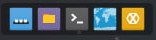
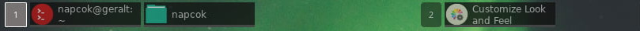
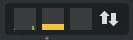
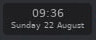
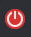
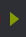
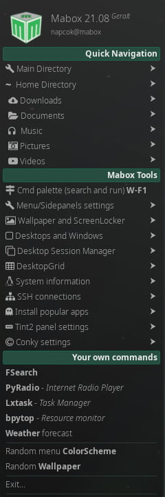

# Presentación de Mabox Linux Desktop

    

## Menu principal

Usted puede acceder al menu principal por medio de :

  - hacer clic sobre el ícono Mabox del panel
  - hacer clic derecho encima de cualquier área del escritorio
  - presionando la combinación de teclas  ++super+espacio++   o solamente con la tecla  ++super++  (tecla windows)

El Menu permite la búsqueda de programas, con solo escribir la palabra de la aplicacion que esta buscando.

---

---
## Conky
Existen dos recuadros de Conky ubicados por defecto en el escritorio inicial deMabox. **Monitoreo e información del sistema** en la parte superior de la esquina derecha y otro recuadro Conky en la parte inferior izquierda presentando **la mayoría de los atajos de teclado**.

Usted puede activar/desactivar estos recuadros Conky con el atajo de teclas ++super+alt+c++.

Lea más acerca de los recuadros informativos Conky [Conky configuration in Mabox](../../configuration/conky/)

---
## Panel de Tint2 

**Tint2** es el panel ligero y altamente configurable usado por Mabox. Por defecto se ubica en la parte superior de la pantalla de inicio.

    

Examinemos cada elemento del panel desde izquierda a derecha.
Lea más acerca de la configuracion de  [Tint2 panel configuration in Mabox](../../configuration/tint2/)
---
### Lanzador del panel lateral izquierdo
{ align=left }

**Botón de la flecha izquierda**

se usa para lanzar el  **Panel lateral izquierdo** ++ctrl+super+left++

---
### Logo de Mabox (*menu de inicio*)
{ align=left }

**el botón logo de Mabox**

lanzará el  **Menu principal** ++super++

el clic derecho encima lanzará el  **Menu de ajustes** ++super+s++

---
### Lanzadores

Luego sigue **Lanzadores** con 5 íconos por defecto:

- **Mostrar el escritorio** ++ctrl+d++
- **Gestor de archivos** ++super+f++
- **Terminal ** ++super+t++
- **Navegador** ++super+w++
- Cliente de Irc Hexchat

!!! hint "¿Cómo agregar/quitar lanzadores al  panel?"
    Dirigirse a **Menu de ajustes** ++super+s++ -> **Paneles Tint2 ** -> **Agregar/Quitar Lanzadores**

    <iframe width="560" height="315" src="https://www.youtube.com/embed/CqxQfLXRoWM" title="YouTube video player" frameborder="0" allow="accelerometer; autoplay; clipboard-write; encrypted-media; gyroscope; picture-in-picture" allowfullscreen></iframe>

---
### Listas de tareas en el escritorio

**Indicadores del escritorio** y **listas de tareas**.

Acciones de tareas:

- **Clic izquierdo** - activar o iconificar
- **rueda del ratón** - activar o iconificar
- **Clic central** - cerrar
- **Arrastrar** mover la ventana a otro escritorio/espacio de trabajo

---
### Bandeja del sistema

**Bandeja del sistema** con recursos de monitoreo sencillos.
Cinco monitoreos disponibles, vienen trés activados por defecto:

- CPU
- Memoria
- Swap *desactivado*
- Redes 
- Disc IO *desactivado*

Dale clic encima de los monitoreos y ejecutará el gestor de tareas sencillas de  `lxtask`

Para configurar/desactivar la **Bandeja de monitoreo HW** ir a : **Menu de ajustes** ++super+s++ -> **Tint2 paneles** -> **Systray HW monitor**.

---
### Reloj

**Reloj y fecha**.
Dar clic para mostrar el calendario.

---
### Salida
{align=left}

**Dialogo de salida** ++super+x++

---
### Lanzador del panel lateral derecho
{ align=left }

**botón de la flecha derecha**

se usa para lanzar el  **Panel lateral derecho** ++ctrl+super+right++

---
## Paneles laterales

{ align=left } Mabox Linux ofrece también dos paneles laterales de acceso rápido.

**Panel lateral izquierdo** ++ctrl+super+left++ ofrece acceso rápido a cualquier directorio y a una lista creciente de herramientas de Mabox.

Usted puede navegar al lugar que quiera, y abrir el gestor de archivos o la terminal en esa ubicación.

El panel lateral izquierdo además  le mostrará sus marcadores de GTK (marcadores de directorios en el gestor de archivos  – PCManFM)

Algunas herramientas de Mabox disponibles en el Panel lateral izquierdo:

  - **Ajustes de Menu/Panel lateral ** ++super+alt+m++ – permite ajustar la apariencia del  menu/paneles 
  - **Fondos de escritorio y bloqueo de pantalla** ++super+alt+w++ - configura el fondo de escritorio y el bloqueo de pantalla
  - **DesktopGrid de escritorio** - administra sus ventanas en una rejilla con o sin espacios estilo tiling
  - **Gestor de escritorio** – guarda o restaura sesiones de trabajo con el escritorio  (guarda todas ventanas de trabajo en la sesion actual con su tamaño y ubicación, y mas tarde la restaura en una nueva  sesión en cualquier espacio de trabajo)
  - **Conexiones SSH** – lista todas las conexiones de SSH, desde `~/.ssh/config`
  - **Menu de ajustes panel Tint2 **
  - **Menu de ajustes de los Conky**

**Panel lateral derecho** ++ctrl+super+right++ es un acceso rápido a varios ajustes más y entrega vínculos de ayuda online.

---
##Fondos de escritorio

**Nitrogen**  se usa como gestor basico de fondos de escritorio.
Pero existen mas opciones... ++super+alt+w++
