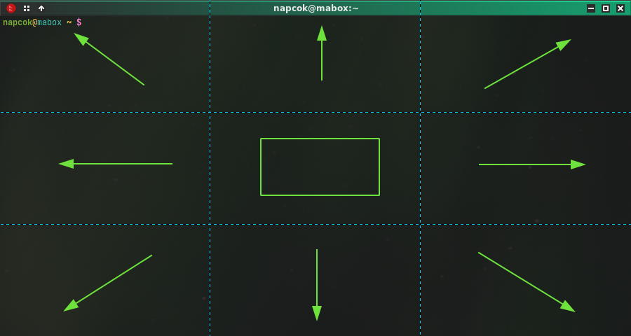

    

Openbox es un clásico gestor de ventanas flotantes, a pesar de esto en Mabox viene preconfiguradas algunas acciones útiles para que usted manualmente use el tile windows  o división de ventanas para sus aplicaciones y las reposicione o reubique en otro lugar si lo desea.

Puede mover las ventanas a su alrededor de la pantalla fácilmente por medio de algunos atajos de teclado habilitados por defecto.

_Pruebe mientras lee_

## Ajustar tamaño y mover ventanas con el teclado
!!! danger inline end "Véalo en acción..."
    Ver el video:<a class="videolink" href="../../img/tiling_super_arrows.mp4">aquí</a>

_Partir la pantalla en mitades_

Pruebe con : ++super+left++ , ++right++ , ++up++ , ++down++

<video controls width="100%" src="../../img/tiling_super_arrows.mp4" type="video/mp4">
</video>

---
!!! danger inline end "Véalo en acción..."
    Ver video:<a class="videolink" href="../../img/tiling_numpad.mp4">aquí</a>
_Partir pantalla en cuartos_

Con ++super+"keypad keys"++ usted puede además ajustar el tamaño y desplazar la ventana a la esquina o extremo del escritorio

||||
|-|-|-|
|++num7++ topleft | ++num8++ top | ++num9++ topright|
|++num4++ left | ++num5++ center | ++num6++ right|
|++num1++ bottomleft | ++num2++ bottom | ++num3++ bottomright|

<video controls width="100%" src="../../img/tiling_numpad.mp4" type="video/mp4">
</video>

### Otros atajos de teclado útiles con las ventanas

++super+enter++ or ++f11++ - pantalla completa, dale al mismo atajo de nuevo y vuelve atrás

++super+b++ - activa las decoraciones de la ventana activa

++alt+f6++ , ++super+home++ - activa maximizar la ventana

## Dale clic para posicionar la ventana
Dale clic al ratón o panel táctil de tu sistema justo encima de una de las áreas de las ventanas para posicionarla en las áreas de la rejiilla de entrenamiento en la direccion que deseas.

Usa la combiación de teclas ++ctrl+shift++ +  luego dale clic encima de la área de la rejilla de entrenamiento

Ver áreas...

Esto  funciona tanto con ventanas activas o inactivas por defecto, por tanto le facilita un modo simple de ubicar sus aplicaciones en  las ventanas abiertas en donde usted las necesite en la pantalla.

<video controls width="100%" src="../../img/tiling.webm" type="video/mp4">
</video>

Observe que existe un espacio entre las ventanas ubicadas. Este espacio es configurables y es una parte de  [La rejilla del escritorio](../../extras/desktopgrid) una característica de Mabox.

Use la combinacion de teclas ++ctrl+shift+" luego presione los números del teclado numerico de su PC entre el 1 al 9"++ para lograr este mismo efecto de ubicar ventanas sin usar el ratón.
