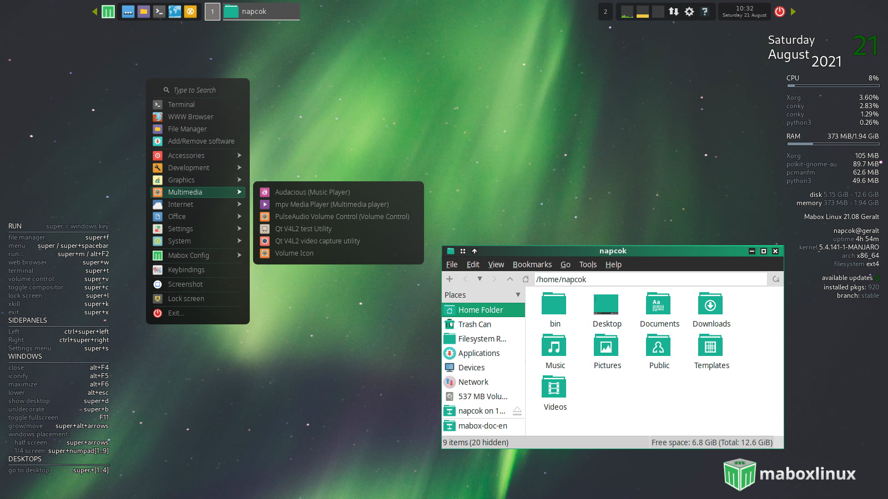
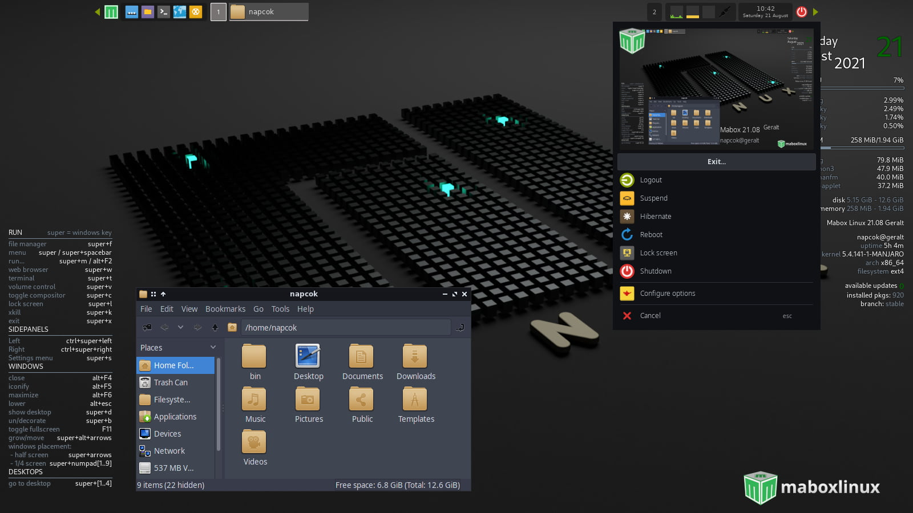
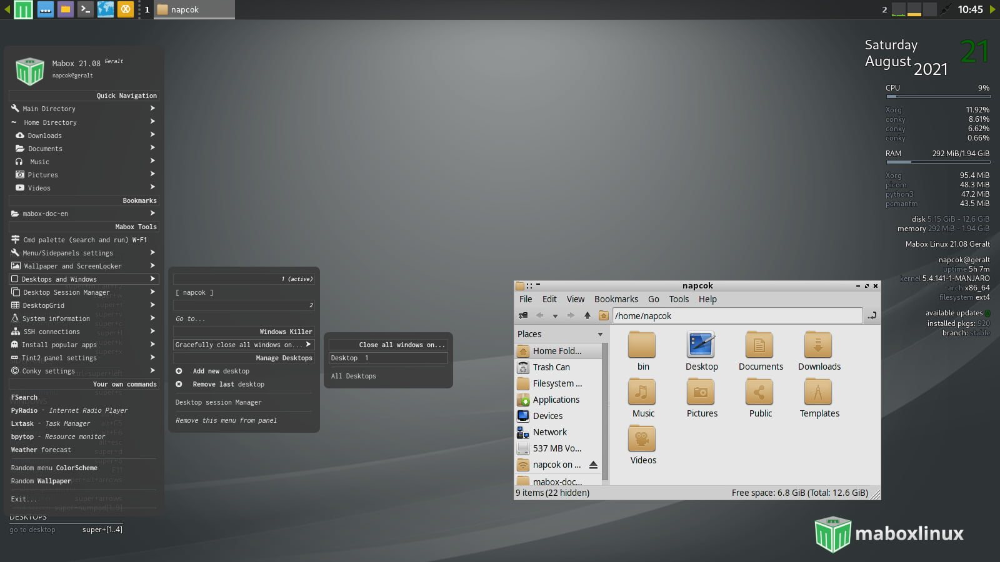
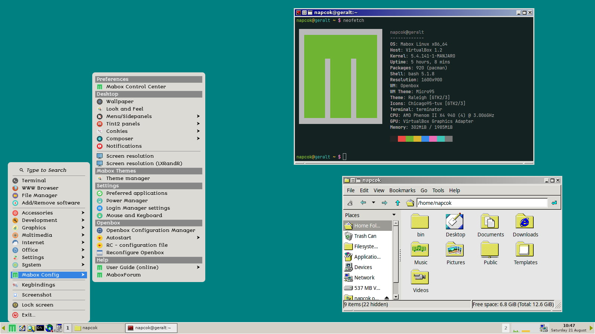
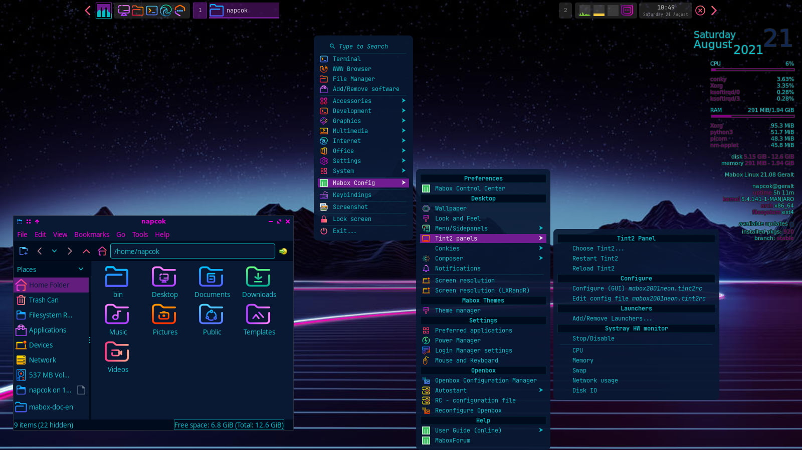
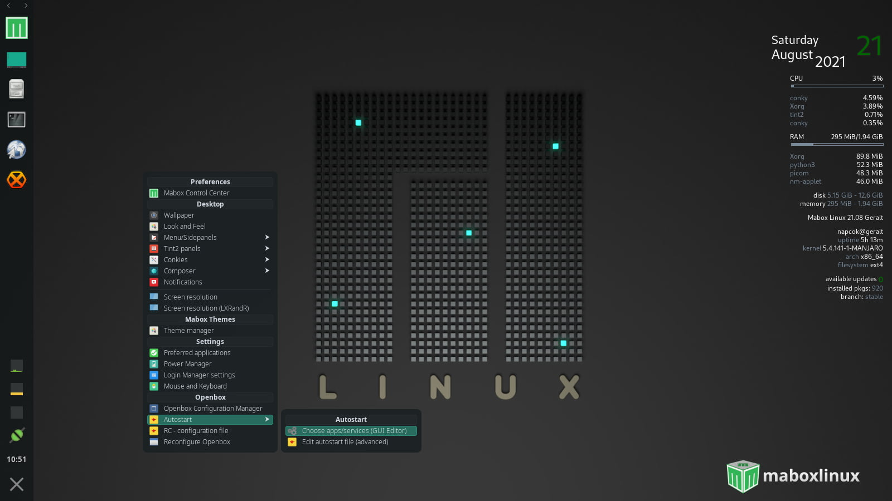
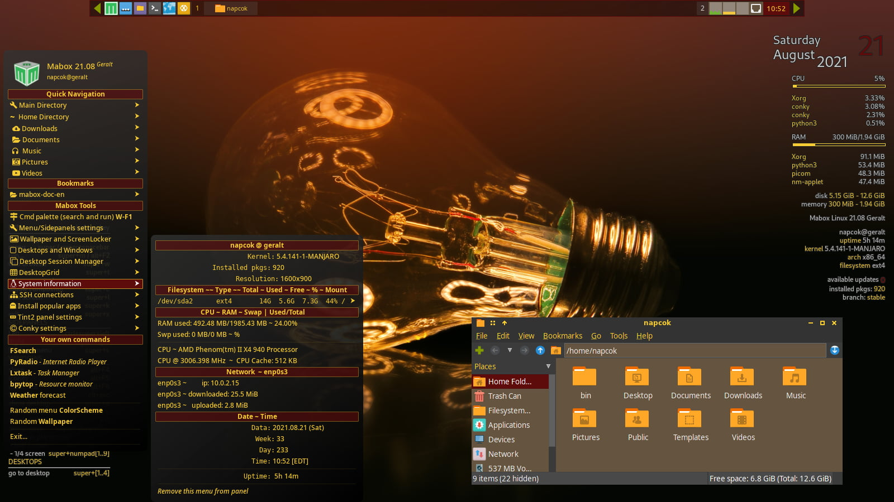

---
hide:
  - navigation
---
# ¡Bienvenido al manual de Mabox!
Bienvenido al Manual en español! Es un texto de apoyo para usar Mabox. Este manual cubre varios partes, tales como instalación, aplicaciones aportadas de Mabox, y mucho más!

## ¿Qué es Mabox?

Las metas del proyecto son:

- entregar un sistema Linux **ligero, veloz** y **listo para usar**, el cual opere lo más  óptimo aún en aquellos sistemas débiles en recursos.

- estando basado en principios **sólidos y estables**, que permita **acceso rápido** a las  **versiones de software más actualizadas**

Mabox es una distribución  de tipo *rolling-release* basada en  **Manjaro Linux**.

??? info "Ventajas y Desventajas  de un modelo de desarrollo de tipo *rolling-release* "
    **Ventajas:**

    - Se instala sólo una vez & se actualiza para siempre. No se necesita reinstalar un nuevo sistema operativo cada  6-12 meses

    - Acceso rápido a las versiones mas actualizadas de los paquetes de software, no se necesita acceder a paquetes tipo snaps o flatpaks  para ejecutar estos programas

    **Desventajas:**

    - Actualizaciones parciales no se soportan - usted debe actualizar su sistema antes de instalar un nuevo software 

    - Usted necesita de una buena velocidad de banda ancha (internet) para estas actualizaciones que lo que requieren otras distribuciones tradicionales en el mercado 

## ¿Qué entorno de escritorio usa Mabox?
Ninguno. Mabox no tiene un entorno de escritorio definido e integrado como los tradicionales (Gnome, KDE, LXDE, XFCE,Mate, Budgie...).
Mabox ha sido construido encima del gestor de ventanas clásico OpenBox con componentes ligeros altamente configurables y cuidadosamente seleccionados. Y además con herramientas  domésticas propias que permiten mostrarlo como un escritorio moderno y aerodinámico.

- tint2[^1] es el panel usado.

- menus y paneles laterales basados en  jgmenu[^2].

- varias herramientas y utilidades de la casa.

- varios componentes provienen de LXDE y Xfce

- pocas herramientas BunsenLabs[^3] adaptadas para Mabox (gestor de temas, paneles tint2 y scripts administradores conky)

    
    
    
    
    
    
    

## ¿Es Mabox estable para el uso diario?

Respuesta corta: **sí**

¿Cómo es logrado esto?

- Mabox esta basado en la rama de **Manjaro estable**.
??? info "¿Cómo operan las ramas en Manjaro?"
    Origen [Manjaro wiki](https://wiki.manjaro.org/index.php/Switching_Branches#Overview):

    >Los paquetes de Manjaro inician sus vidas en la rama *inestable*. Una vez que se les considera que estan estables, son trasladados a la *rama de prueba*, en donde se le realizan mas pruebas con el fín de poder ser enviados a la rama *estable*.

    >Los paquetes que llegan a ser estables han recorrido duras semanas de pruebas por grupos de usuarios de los repositorios Unstable/Testing, hasta que son paquetes finales. Todos estos paquetes estan libres de fallos.

- Mabox utiliza núcleos de Linux *muy sólidos* denominados  **LTS kernel** por defecto.

- **Openbox** alcanzó todas sus metas de desarrollo en 2010 y se considera un proyecto terminado, un gestor de ventanas altamente estable. Existe un mantenimiento ocasional realizado por los autores para que siga operativo, solamente si fuese necesario.

## Contáctenos
Tiene preguntas? Quiere involucrarse? Visitenos entonces [sitio web oficial](https://maboxlinux.org), [blog](https://blog.maboxlinux.org), [foro de discusión de Mabox](https://forum.maboxlinux.org).

## Gracias totales
Le agradecemos su preferencia al usar Mabox Linux!

*[DE]: Entorno de escritorio gráfico
*[WM]: Gestor de ventanas
*[LTS]: Soporte de larga duración

[^1]: [tint2](https://gitlab.com/o9000/tint2) - un panel/barra de tareas liviano para  Linux y BSD
[^2]: [jgmenu](https://jgmenu.github.io/) - un menu sencillo, independiente, moderno de apariencia X11, diseñado para scripting, ricing y tweaking.
[^3]: [BunsenLabs](https://bunsenlabs.org) - Distribución basada en Debian destacando un tipo escritorio Openbox preconfigurado

